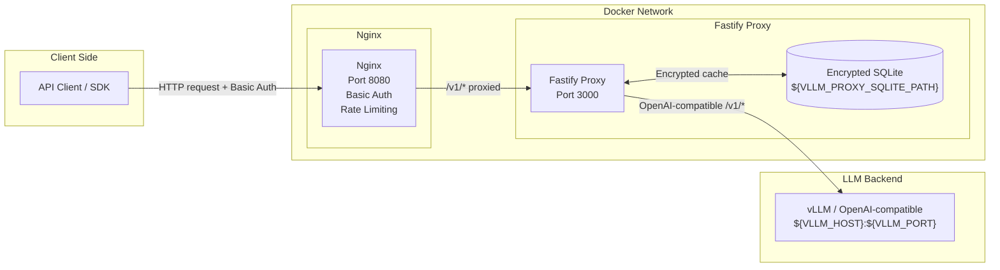

# vLLM · Fastify · Nginx

A secure, authenticated proxy setup for vLLM and any OpenAI-compatible backend with **Nginx** and a **Fastify proxy with an encrypted SQLite cache for requests/responses**. Supports both local development and one-image RunPod deployment.

- **vLLM Integration** - OpenAI-compatible `/v1/*` API proxied through a Fastify service
- **Request/Response Caching** - All `/v1/*` requests and responses are stored in a local, encrypted SQLite cache
- **Security** - Basic authentication at nginx, rate limiting, security headers
- **Monitoring** - Health checks, status script, and access logging
- **Containerized** - Nginx and Fastify proxy run in Docker; backend can be any local OpenAI-compatible server or in-container vLLM on RunPod
- **Easy Setup** - Automated setup and management scripts / Makefile targets

## Make Commands

| Command              | Description                                                   |
|----------------------|---------------------------------------------------------------|
| `make help`          | Show available Make targets and descriptions                  |
| `make setup`         | One-time setup: generate nginx config, auth, checks           |
| `make start`         | Start all services                                            |
| `make stop`          | Stop all Docker services                                      |
| `make status`        | Show Docker status + backend, nginx, Fastify health           |
| `make logs`          | Tail logs from all services                                   |
| `make test`          | Run API smoke tests                                           |
| `make test-local`    | Run E2E tests against local HTTP stack                        |
| `make clean`         | Remove containers, volumes and prune Docker system            |
| `make restart`       | Restart all services (`make stop` + `make start`)             |
| `make build`         | Build/rebuild Docker images                                   |
| `make update`        | `git pull`, rebuild containers, and restart services          |
| `make build-runpod`  | Build the all-in-one RunPod image                             |
| `make push-runpod`   | Push RunPod image to Docker Hub                               |
| `make release-runpod`| Build + push RunPod image                                     |

## Quick Start

### Local development (any OpenAI-compatible backend)

1. **Clone and setup:**
   ```bash
   cd vllm-nginx-proxy
   chmod +x scripts/*.sh
   ./scripts/setup.sh
   ```

2. **Configure `.env`:**
   ```bash
   VLLM_MODEL="your-preferred-model"
   NGINX_BASIC_AUTH_USERNAME=admin
   NGINX_BASIC_AUTH_PASSWORD=secure_pass
   ```

3. **Start services (local overlay):**
   ```bash
   docker compose -f docker-compose.yml -f docker-compose.local.yml up --build -d
   ```

4. **Test the OpenAI-compatible API:**
   ```bash
   # List models
   curl -u admin:secure_pass "http://localhost:8080/v1/models"

   # Chat completion
   curl -u admin:secure_pass \
     -H "Content-Type: application/json" \
     -d '{"model":"your-model","messages":[{"role":"user","content":"Hello!"}],"stream":false}' \
     "http://localhost:8080/v1/chat/completions"
   ```

### RunPod deployment

See [RunPod deployment](#runpod-deployment) section below.

## Environment Variables

| Variable                                        | Description                                                                              | Default                |
|-------------------------------------------------|------------------------------------------------------------------------------------------|------------------------|
| `VLLM_MODEL`                                    | Model identifier                                                                         | `google/gemma-3-12b`   |
| `VLLM_HOST`                                     | Backend host                                                                             | `localhost`            |
| `VLLM_PORT`                                     | Backend port                                                                             | `8000`                 |
| `VLLM_PROXY_SQLITE_HOST_DIR`                    | Host directory for the Fastify SQLite cache DB                                           | `./fastify-proxy/data` |
| `VLLM_PROXY_WEBHOOK_ON_CHAT_COMPLETE`           | Optional webhook URL fired after chat completions                                        | _empty_                |
| `VLLM_PROXY_WEBHOOK_ON_CHAT_COMPLETE_HEADERS`   | Optional JSON headers sent with the webhook request                                      | _empty_                |
| `VLLM_PROXY_SQLITE_CACHE`                       | Enable/disable writing requests/responses to the encrypted SQLite cache                  | `true`                 |
| `VLLM_SQLITE_ENCRYPTION_KEY`                    | Secret used to encrypt/decrypt cached request/response bodies in SQLite                  | Required               |
| `VLLM_PROXY_RESPONSE_SIGNING_SECRET`            | Secret for HMAC signatures on proxy responses (`X-Response-Signature` header)           | _empty_                |
| `VLLM_PROXY_REQUEST_SIGNING_SECRET`             | Optional secret to verify inbound requests via HMAC (`x-request-signature` header)      | _empty_                |
| `VLLM_PROXY_REQUEST_TIMEOUT`                    | Timeout for backend requests in milliseconds                                             | `600000` (10 min)      |
| `VLLM_PROXY_WEBHOOK_TIMEOUT`                    | Timeout for webhook calls in milliseconds                                                | `30000` (30 s)         |
| `NGINX_PORT`                                    | Nginx HTTP port                                                                          | `8080`                 |
| `NGINX_SSL_PORT`                                | Nginx HTTPS port                                                                         | `8443`                 |
| `NGINX_PROXY_CONNECT_TIMEOUT`                   | Nginx proxy connect timeout (seconds)                                                    | `90`                   |
| `NGINX_PROXY_SEND_TIMEOUT`                      | Nginx proxy send/read timeout (seconds)                                                  | `330`                  |
| `NGINX_BASIC_AUTH_USERNAME`                     | API username                                                                             | `admin`                |
| `NGINX_BASIC_AUTH_PASSWORD`                     | API password                                                                             | `secure_password_123`  |
| `RATE_LIMIT`                                    | Rate limit                                                                               | `10r/s`                |
| `RATE_BURST`                                    | Rate limit burst                                                                         | `20`                   |

### Generating strong secrets

```bash
openssl rand -base64 32
```

Set in `.env`:
```bash
VLLM_SQLITE_ENCRYPTION_KEY="<output>"
VLLM_PROXY_RESPONSE_SIGNING_SECRET="<output>"
```

To verify inbound requests via HMAC also set:
```bash
VLLM_PROXY_REQUEST_SIGNING_SECRET="<output>"
```

When `VLLM_PROXY_REQUEST_SIGNING_SECRET` is set, the Fastify proxy will **verify an HMAC over the JSON request body** for all `/v1/*` requests. Callers must send:

- Header: `x-request-signature`
- Value: `hex(HMAC_SHA256(VLLM_PROXY_REQUEST_SIGNING_SECRET, JSON.stringify(body)))`

If the header is missing or invalid, the proxy responds with `401 { "error": "invalid_signature" }`.

## Architecture



## API Usage

### Health Check
```bash
curl http://localhost:8080/health
```

### List models
```bash
curl -u username:password "http://localhost:8080/v1/models"
```

### Non-streaming chat completion
```bash
curl -u username:password \
  -H "Content-Type: application/json" \
  -d '{"model":"llama2","messages":[{"role":"user","content":"Hello!"}],"stream":false}' \
  "http://localhost:8080/v1/chat/completions"
```

### Streaming chat completion
```bash
curl -u username:password \
  -H "Content-Type: application/json" \
  -d '{"model":"llama2","messages":[{"role":"user","content":"Tell me a story"}],"stream":true}' \
  "http://localhost:8080/v1/chat/completions"
```

## RunPod Deployment

The project ships a single all-in-one image (`Dockerfile.runpod`) that runs **vLLM + Nginx + Fastify proxy** under supervisord.

### Build and push

```bash
# Set your Docker Hub username
export DOCKER_HUB_USERNAME=yourdockerhubuser

make release-runpod
```

### Deploy on RunPod

1. Go to **RunPod → Templates → New Template**
2. Set **Container Image** to `yourdockerhubuser/vllm-nginx-proxy:latest`
3. Set **Container Port** to `8080`
4. Add environment variables:
   ```
   VLLM_MODEL=meta-llama/Llama-2-7b-chat-hf
   NGINX_BASIC_AUTH_USERNAME=admin
   NGINX_BASIC_AUTH_PASSWORD=<strong password>
   VLLM_SQLITE_ENCRYPTION_KEY=<openssl rand -base64 32>
   VLLM_PROXY_RESPONSE_SIGNING_SECRET=<openssl rand -base64 32>
   ```
5. Set GPU type (A100/H100 recommended for large models)
6. Deploy — RunPod exposes port `8080` via HTTPS automatically

## Security Features

- **Basic Authentication** - Username/password protection via nginx
- **Rate Limiting** - Configurable request limits
- **Security Headers** - XSS protection, content-type sniffing prevention
- **Request/Response HMAC Signing** - Optional end-to-end integrity verification
- **Encrypted Cache** - SQLite request/response cache encrypted at rest
- **Request Size Limits** - Prevents large payload attacks
- **Access Logging** - Monitor and audit API usage

## Monitoring

- **Nginx health check**: `http://localhost:8080/health`
- **Fastify proxy health** (inside Docker): `curl http://localhost:3000/health` from the `vllm-fastify-proxy` container
- **All logs**: `docker compose logs -f`
- **Specific service**: `docker compose logs -f nginx` / `docker compose logs -f vllm-fastify-proxy`

## Troubleshooting

1. **Docker not running**
   ```bash
   open -a Docker   # macOS
   sudo systemctl start docker   # Linux
   ```

2. **Backend not reachable** — verify `VLLM_HOST` and `VLLM_PORT` in `.env` match your running vLLM / Ollama / llama.cpp instance.

3. **Model not available**
   ```bash
   export VLLM_MODEL="your-preferred-model"
   ```

4. **Permission denied on scripts**
   ```bash
   chmod +x scripts/*.sh
   ```

5. **Nginx config errors**
   ```bash
   docker compose exec nginx nginx -t
   ```

## License

MIT License - feel free to modify and distribute.
