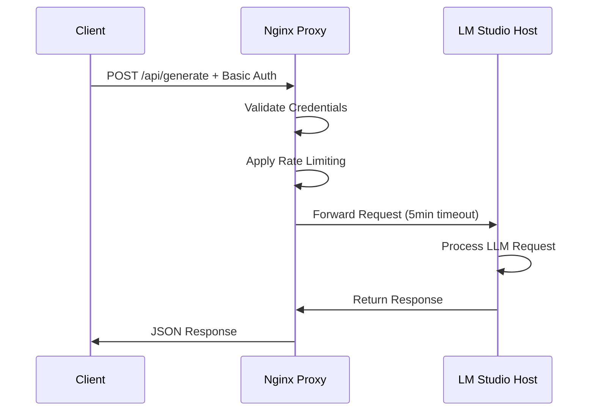
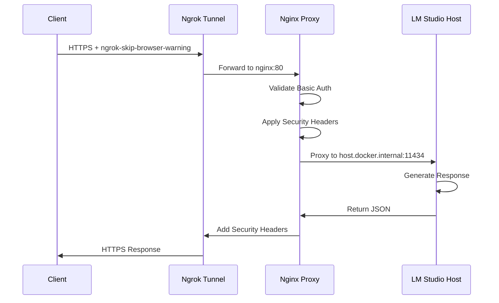
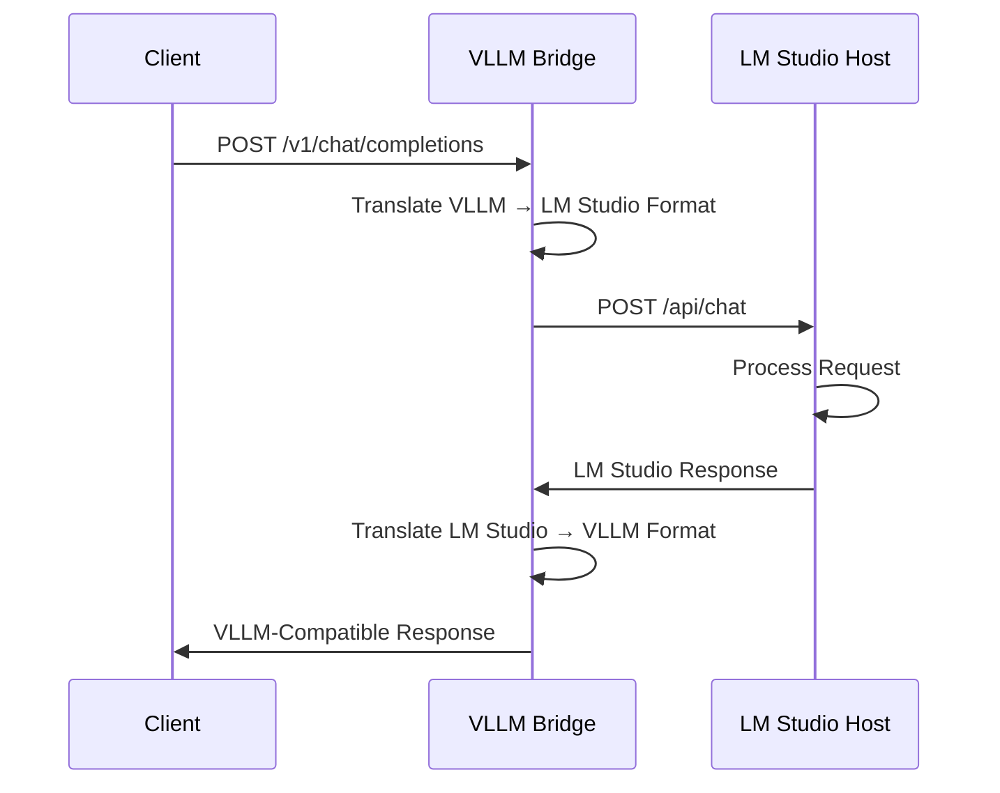
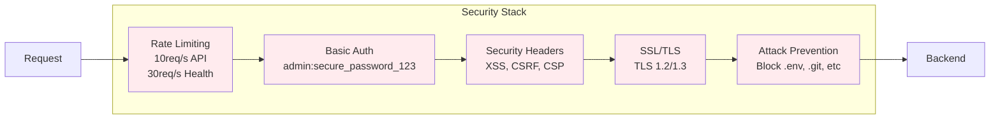

# Request Flow Diagram

## Architecture Overview

```mermaid
graph TB
    subgraph "External Access"
        Client[Client/Bruno]
        Browser[Web Browser]
    end
    
    subgraph "Public Internet"
        Ngrok[Ngrok Tunnel<br/>https://34bcf1494c22.ngrok-free.app]
    end
    
    subgraph "Docker Network"
        direction TB
        NginxProxy[Nginx Proxy<br/>:80, :443<br/>Auth + Rate Limiting]
        LM StudioService[LM Studio Service<br/>:11434<br/>LLM Processing]
        VLLMBridge[VLLM Bridge<br/>:8000<br/>API Translation]
    end
    
    subgraph "Host System"
        LM StudioHost[LM Studio Server<br/>0.0.0.0:11434]
    end
    
    %% Request Flow - Direct Local
    Client -->|HTTP/HTTPS<br/>localhost:8080/8443| NginxProxy
    
    %% Request Flow - Public via Ngrok
    Client -->|HTTPS + ngrok-skip-browser-warning| Ngrok
    Ngrok -->|Forward to nginx:80| NginxProxy
    
    %% Internal Processing
    NginxProxy -->|Basic Auth<br/>admin:secure_password_123| NginxProxy
    NginxProxy -->|Proxy Pass<br/>5min timeout| LM StudioHost
    
    %% VLLM Bridge Flow
    Client -->|VLLM API<br/>localhost:8000| VLLMBridge
    VLLMBridge -->|Translate & Forward| LM StudioHost
    
    %% Health Check
    Browser -->|GET /health<br/>+ Auth| NginxProxy
    NginxProxy -->|200 OK + timestamp| Browser
    
    %% Styling
    classDef external fill:#e1f5fe
    classDef public fill:#f3e5f5
    classDef docker fill:#e8f5e8
    classDef host fill:#fff3e0
    
    class Client,Browser external
    class Ngrok public
    class NginxProxy,LM StudioService,VLLMBridge docker
    class LM StudioHost host
```

## Request Types

### 1. Direct Local Access


### 2. Public Ngrok Access


### 3. VLLM Bridge Access


## Security Layers



## Timeout Configuration

| Component | Connect | Send | Read | Total |
|-----------|---------|------|------|-------|
| Client Body | - | - | - | 300s |
| Client Header | - | - | - | 60s |
| Proxy Connect | 60s | - | - | - |
| Proxy Send | - | 300s | - | - |
| Proxy Read | - | - | 300s | - |
| Keepalive | - | - | - | 300s |

*All timeouts optimized for LLM processing (5-minute max)*
