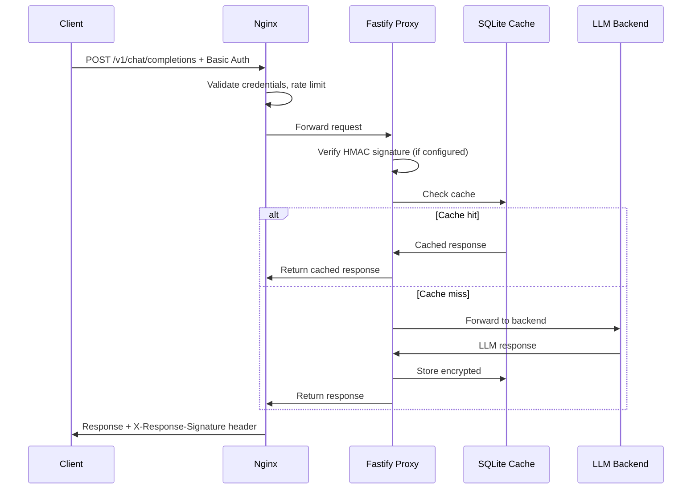
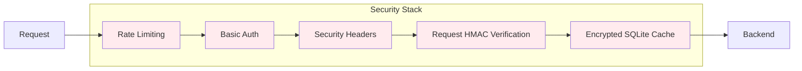

# Request Flow Diagram

## Architecture Overview

```mermaid
graph TB
    subgraph "Client"
        Client[API Client / SDK]
    end

    subgraph "Docker Network"
        direction TB
        NginxProxy[Nginx Proxy<br/>:8080<br/>Basic Auth + Rate Limiting]
        FastifyProxy[Fastify Proxy<br/>:3000<br/>Cache + Signing]
        SQLite[(Encrypted SQLite)]
    end

    subgraph "LLM Backend"
        Backend[vLLM / LM Studio<br/>VLLM_HOST:VLLM_PORT]
    end

    Client -->|HTTP + Basic Auth| NginxProxy
    NginxProxy -->|/v1/* proxied| FastifyProxy
    FastifyProxy <-->|Encrypted cache| SQLite
    FastifyProxy -->|OpenAI-compatible /v1/*| Backend

    classDef docker fill:#e8f5e8
    classDef backend fill:#fff3e0

    class NginxProxy,FastifyProxy,SQLite docker
    class Backend backend
```

## Request Flow

```mermaid
sequenceDiagram
    participant C as Client
    participant N as Nginx
    participant F as Fastify Proxy
    participant DB as SQLite Cache
    participant B as LLM Backend

    C->>N: POST /v1/chat/completions + Basic Auth
    N->>N: Validate credentials, rate limit
    N->>F: Forward request
    F->>F: Verify HMAC signature (if configured)
    F->>DB: Check cache
    alt Cache hit
        DB->>F: Cached response
        F->>N: Return cached response
    else Cache miss
        F->>B: Forward to backend
        B->>F: LLM response
        F->>DB: Store encrypted
        F->>N: Return response
    end
    N->>C: Response + X-Response-Signature header
```

## Security Layers

```mermaid
graph LR
    subgraph "Security Stack"
        A[Rate Limiting]
        B[Basic Auth]
        C[Security Headers]
        D[Request HMAC Verification]
        E[Encrypted SQLite Cache]
    end

    Request --> A --> B --> C --> D --> E --> Backend

    classDef security fill:#ffebee
    class A,B,C,D,E security
```

## Timeout Configuration

| Component       | Connect | Send | Read  | Total |
|-----------------|---------|------|-------|-------|
| Proxy Connect   | 90s     | -    | -     | -     |
| Proxy Send      | -       | 330s | -     | -     |
| Proxy Read      | -       | -    | 330s  | -     |
| Fastify Request | -       | -    | -     | 600s  |
| Webhook         | -       | -    | -     | 30s   |

*Timeouts optimized for long LLM inference tasks.*
